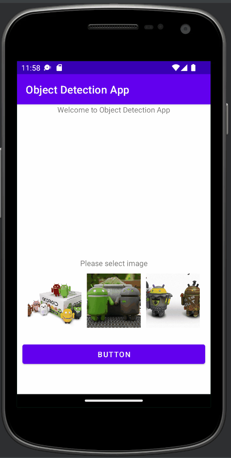

# Object-detect-app

## Features

* [X] Detect Android Figurines using TensorFlow Lite Model Maker
* [X] Model is integrated within app
* [ ] Capture image from camera
* [ ] Detect different objects (not just Android Figurines: https://tfhub.dev/tensorflow/lite-model/efficientdet/lite0/detection/default/1)
* [ ] Model on cloud, use API to send/get result

## Video Walkthrough

Here's a walkthrough of implemented features:

GIF created with [ScreenToGif](https://www.screentogif.com/) ver.2.37 portable (x64).  

